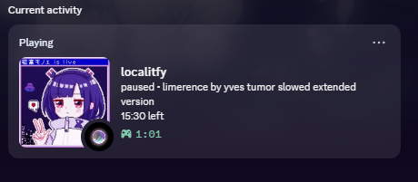
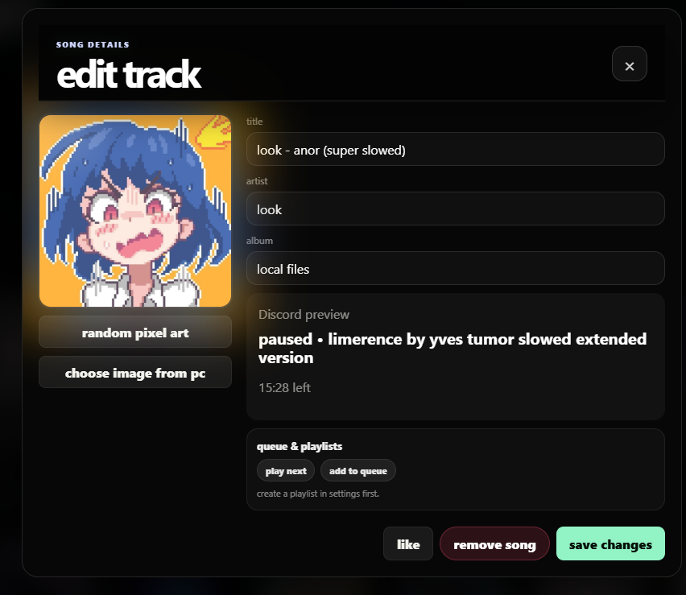

# localtify

> your local music, but prettier.

localtify is a Spotify inspired desktop music player made for people who still keep songs on their PC.

It gives your local music library a clean dark interface, smooth animations, ambient visuals, themes, listening stats, and Discord Rich Presence without any subscriptions, or random nonsense getting in the way. > (pssssst no ads too)

---

## features

- play your own local songs
- import music into your library
- import songs from YouTube using the built-in YouTube to MP3 method
- dark OLED-style interface
- smooth animations when switching songs
- ambient glow based on the cover art
- album art system
- search and library filtering
- liked songs
- listening stats
- Discord Rich Presence
- custom themes
- auto updates
- no ads, obviously

---

## screenshots

---

## download

You can download the latest version from the releases page:

https://github.com/meshahid973/localitfy/releases

---

## notes

localtify is still pretty new, so some things might break here and there.

Right now I’m mainly focused on making the app feel smoother, cleaner, faster, and more polished with every update.

No bugs this time… hopefully.

---

## contributors

big thanks to:

- @todouro
- @yudafao
