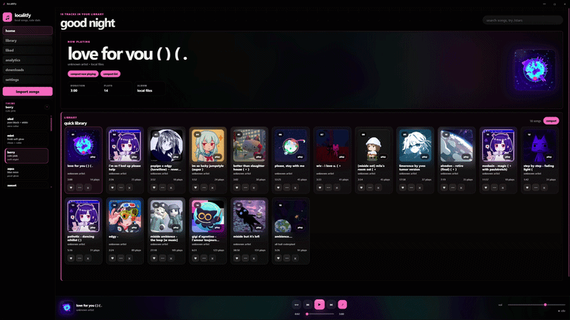
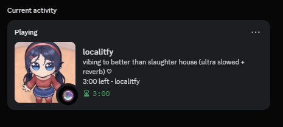

# localitfy

> a Spotify-inspired desktop music player for local music. (psssstt no ads too)

localitfy gives your own music library a cleaner, darker, more modern feel with smooth animations, ambient visuals, stats, and Discord Rich Presence.

---

## features

- import and play local songs
- OLED-style interface
- smooth song change animations
- ambient cover glow
- album art system
- search
- 0 ads too🤩
- liked songs
- listening stats
- Discord Rich Presence
- themes
- auto updates

---

## screenshots

---

## download

download the latest version from the releases page:

https://github.com/meshahid973/localitfy/releases

---

## notes

localitfy is still early, so some stuff may break.

right now I am focusing on making the app feel smooth, clean, stable, and actually nice to use before adding too many random features.

nooo buggs this time... surely...

---

## contributors

thanks to:

- @todouro
- @yudafao
