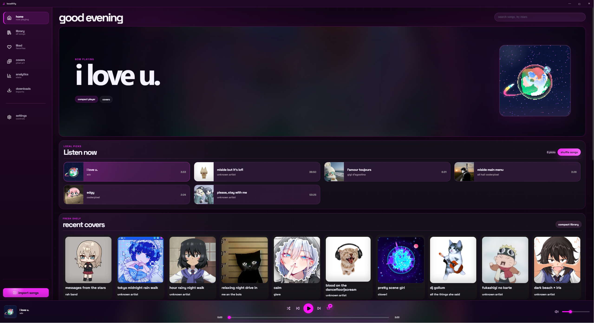

<div align="center">

# localtify

### your local music, but prettier.

A cute local music player for people who still keep songs on their PC.

<br />



<br />
<br />

<a href="https://github.com/meshahid973/localitfy/releases">
  
</a>


<br />
<br />

<strong>No account.</strong> <strong>No subscription.</strong> <strong>No ads between your songs.</strong> <strong>Your music stays on your computer.</strong>

</div>

---

## What is localtify?

localtify is a Spotify inspired desktop music player for your own local files.

You import the songs you already have, and localtify turns them into a proper music library with albums, playlists, covers, themes, stats, Discord Rich Presence, desktop controls, and a smooth dark interface.

It is made for people who like owning their music and want their local library to feel modern again.

---

## What is new in v0.3.7?

v0.3.7 is a big release.

Linux is now supported, and the main new feature is the **Albums** section, suggested in the Issues area by [@Crocodile73](https://github.com/Crocodile73).

The first time setup screen was also fully rebuilt, the app was cleaned up for release, and several performance fixes were made.

### v0.3.7 highlights

| Area        | What changed                                                                          |
| ----------- | ------------------------------------------------------------------------------------- |
| Albums      | New Albums page, album details, custom albums, album covers, play, shuffle, and queue |
| Linux       | AppImage, DEB, and RPM builds are now supported                                       |
| Onboarding  | New first time setup screen for new users and existing users once                     |
| Spotify     | Fixed packaged app issues with missing client ID errors                               |
| UI          | Cleaner sidebar hover, visual settings, album cards, and downloads layout             |
| Performance | CSS cleanup, old patch cleanup, and lighter motion behavior                           |

---

## Download

Get the latest version from the Releases page:

<p>
  <a href="https://github.com/meshahid973/localitfy/releases">
    
  </a>
</p>

### Windows

Download the Windows installer from the latest release.

The file usually looks like this:

```txt
localtify-setup-0.3.7.exe
```

Install it, open localtify, and import your songs.

### Linux

Linux builds are available from the Releases page.

| Format      | Good for                             |
| ----------- | ------------------------------------ |
| `.AppImage` | Most Linux distros                   |
| `.deb`      | Ubuntu, Debian, Linux Mint           |
| `.rpm`      | Fedora, openSUSE, RHEL style distros |

For AppImage, you may need to make it executable first:

```bash
chmod +x localtify-0.3.7-x86_64.AppImage
./localtify-0.3.7-x86_64.AppImage
```

---

## Features

### Music library

* play your own local songs
* import music into your library
* search your songs
* like songs
* create playlists
* add songs to playlists
* shuffle and repeat
* queue songs
* use a clean bottom player
* keep everything local

### Albums

* automatic albums from song metadata
* custom albums made from songs in your library
* custom album title, artist, year, and cover
* album detail pages
* play album
* shuffle album
* queue album
* support for different artists in one album
* proper cover fitting for album cards

### Visuals

* clean dark interface
* themes
* custom theme colors
* pixel art covers
* cover studio tools
* album cover glow in some areas
* smooth sidebar hover
* visual settings for the home page, cards, sidebar, library, and player
* cute little easter eggs like `/yukari` and `/stars`

### Desktop features

* Discord Rich Presence
* privacy controls for Discord activity
* media key support
* tray controls
* startup option on Windows
* update popup
* auto update support
* listening stats
* Windows installer
* Linux AppImage, DEB, and RPM builds

---

## Screenshots

<p align="center">
  
</p>

---

## Run from source

You need:

* Node.js
* npm
* Git

Windows is recommended for the full desktop experience, but Linux builds are now supported too.

Clone the repo:

```bash
git clone https://github.com/meshahid973/localitfy.git
cd localitfy
```

Install dependencies:

```bash
npm install
```

Create your local environment file.

On Windows PowerShell:

```powershell
Copy-Item .env.example .env
```

On macOS or Linux:

```bash
cp .env.example .env
```

You can leave most values empty for normal development.

Run localtify in development mode:

```bash
npm run dev
```

Build the frontend:

```bash
npm run build
```

Build the Windows installer:

```bash
npm run dist
```

Build Linux packages:

```bash
npm run dist:linux
```

The finished app files will be created inside the `release` folder.

---

## Common commands

| Command                 | What it does                             |
| ----------------------- | ---------------------------------------- |
| `npm run dev`           | Starts localtify in development mode     |
| `npm run build`         | Builds the renderer                      |
| `npm run dist`          | Builds the Windows installer             |
| `npm run publish`       | Builds and publishes the Windows release |
| `npm run dist:linux`    | Builds Linux AppImage, DEB, and RPM      |
| `npm run publish:linux` | Builds and publishes Linux release files |
| `npm run chunks:audit`  | Shows the biggest built frontend files   |

---

## Project structure

```txt
src/           React app and UI
electron/      Electron main process, preload, database, updater, Discord, desktop features
pixelart/      bundled pixel art cover images
public/        public static files
build/         app icons and build resources
screenshots/   README and release images
```

---

## Tech stack

localtify uses:

* Electron
* React
* TypeScript
* Vite
* SQLite with better-sqlite3
* Discord RPC
* electron-updater
* electron-builder

Some internal names still use `localitfy` because that was the original project and repo name.

The visible app name is `localtify`.

Please do not rename internal bridge names, IPC names, app IDs, or app data paths unless it is part of a proper migration.

Important internal names:

```txt
window.localitfy
localitfy:* IPC channels
com.meshahid973.localitfy
```

These are kept for compatibility with older installs.

---

## CSS ownership

localtify has a lot of CSS, so please keep styles in the correct file.

| File              | What it owns                                      |
| ----------------- | ------------------------------------------------- |
| `app-core.css`    | app shell, titlebar, base layout                  |
| `App.css`         | older shared app level styles                     |
| `home.css`        | home page, library, albums, playlists, song cards |
| `player.css`      | bottom player, progress bar, volume, controls     |
| `settings.css`    | settings page and settings cards                  |
| `themes.css`      | theme variables and theme mappings                |
| `motion.css`      | animations and transitions                        |
| `effects.css`     | active song glow and small visual effects         |
| `mini-player.css` | detached mini player window                       |

Simple guide:

```txt
player issue      -> player.css
settings issue    -> settings.css
home card bug     -> home.css
album page bug    -> home.css
theme variable    -> themes.css
animation issue   -> motion.css
mini player bug   -> mini-player.css
```

Please avoid random fixes at the bottom of unrelated CSS files. It makes future bugs harder to fix.

---

## Contributing

Pull requests are welcome.

You do not need to be a perfect developer to help. Small fixes, bug reports, screenshots, UI polish, and documentation improvements are all useful.

Good things to work on:

* UI polish
* albums improvements
* playlist improvements
* player improvements
* performance fixes
* Linux testing
* Windows integration
* bug fixes
* accessibility improvements
* cleaner settings pages
* better empty states
* safer update flow
* code cleanup

Before opening a pull request, run:

```bash
npm install
npm run build
```

When making a pull request, please include:

```txt
What changed:
Why it changed:
How you tested it:
Screenshots:
Anything risky:
```

If your change affects the database, settings, updater, playlists, preload, IPC, or app data path, please say that clearly.

---

## Privacy

localtify is built around local music.

Your songs stay on your computer.
You do not need an account.
Discord activity is optional and can be turned off in settings.

Please do not commit private files such as:

```txt
.env
local databases
logs
release builds
node_modules
dist
user data
downloaded music
private exports
```

---

## Files that should not be committed

These should stay ignored:

```txt
.env
.env.*
node_modules/
dist/
release/
.claude/
*.sqlite
*.sqlite3
*.db
*.log
logs/
backups/
localtify_asset_backups/
```

Use `.env.example` for public environment examples.

---

## How to publish source changes

Check what changed:

```bash
git status
```

Add the files you want to push:

```bash
git add README.md src electron package.json package-lock.json .gitignore .env.example public pixelart build screenshots
```

Commit the changes:

```bash
git commit -m "docs: update localtify readme"
```

Push to GitHub:

```bash
git push
```

For the first push from a new local folder:

```bash
git push -u origin main
```

---

## How to publish a new app release

Use this when releasing a new version like `0.3.7`.

Make sure the version is correct in:

```txt
package.json
the app version shown inside localtify
```

Build the app:

```bash
npm run build
```

Build the Windows installer:

```bash
npm run dist
```

Publish the Windows release:

```bash
npm run publish
```

Build Linux packages:

```bash
npm run dist:linux
```

Linux release builds can also be created through GitHub Actions.

---

## Release checklist

Before publishing a release, check:

* the app opens
* songs still load
* playback works for imported and existing songs
* albums open properly
* custom albums save properly
* playlists still load
* importing songs works
* downloaded songs appear in the library
* covers and pixel art fallback covers load
* settings save after restarting the app
* update popup looks correct
* tray menu works
* media keys work
* Discord Rich Presence works when enabled
* startup option works on Windows
* Linux packages build successfully
* app name says localtify
* icon looks correct
* `npm run build` passes
* installer builds successfully
* `.env`, `node_modules`, `dist`, and `release` are not committed

---

## Known notes

* Dev mode may show Electron in some Windows places because it runs through Electron directly.
* The packaged installer should show localtify properly.
* If Windows caches an old icon or name, unpin the old shortcut and pin the newly installed app again.
* Some Windows SmartScreen warnings can happen because the app is not code signed yet.

---

## License

MIT License

---

## Credits

Made by [@meshahid973](https://github.com/meshahid973)

Thanks to everyone who reports bugs, opens issues, tests releases, and suggests features.

Contributors:

* [@todouro](https://github.com/todouro)
* [@yudafao](https://github.com/yudafao)

Special thanks to [@Crocodile73](https://github.com/Crocodile73) for suggesting the Albums section.
